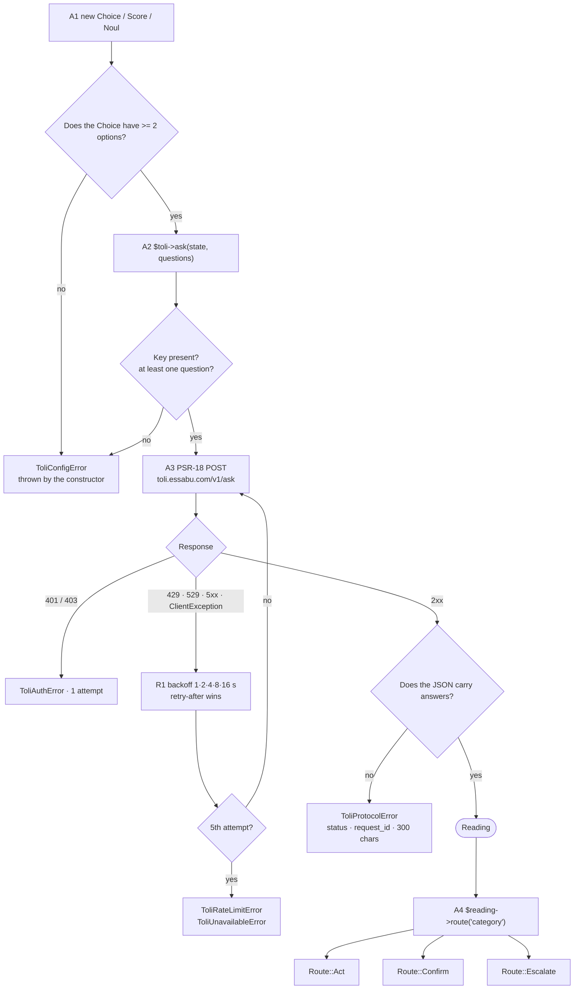

# Toli for PHP

[](https://packagist.org/packages/essabu/toli)

Typed decisions with a calibrated confidence, and the three-route rule that
keeps a human in the loop.

```bash
composer require essabu/toli
```

PHP 8.2+ and any PSR-18 HTTP client (Guzzle, Symfony HttpClient, Laravel's…).
The SDK ships none, so it never fights your application over an HTTP stack.

---

## In one screen

```php
use Essabu\Toli\{Toli, Route, Thresholds};
use Essabu\Toli\Question\{Choice, Noul, Score};

$toli = new Toli(
    apiKey: getenv('TOLI_API_KEY'),
    http: $psr18Client,
    requests: $psr17Factory,
    streams: $psr17Factory,
    thresholds: Thresholds::measured(
        act: 0.85,
        confirm: 0.60,
        measuredOn: '896 support tickets, French',
        measuredAt: '2026-09-18',
    ),
    model: 'toli-1',
);

$reading = $toli->ask(
    // Send what is needed to judge — and nothing more. A name or a phone
    // number has no bearing on a category and no business leaving your
    // infrastructure.
    state: [
        'interface'   => $ticket->interface,
        'feature'     => $ticket->feature,
        'description' => $ticket->description,
    ],
    questions: [
        'category' => new Choice(
            instructions: 'Which team should handle this ticket',
            criteria: [
                'application'     => 'The application misbehaves',
                'hardware'        => 'A device is broken or missing',
                'synchronization' => 'Data does not sync',
                'other'           => 'None of the above',
            ],
        ),
        'urgent' => new Noul('The sender is blocked from working today'),
        'tone'   => new Score(
            instructions: 'How frustrated the sender appears',
            criteria: ['Calm', 'Frustrated but civil', 'Angry, strong language'],
        ),
    ],
);

match ($reading->route('category')) {
    Route::Act      => $ticket->assignTo($reading->value('category')),
    Route::Confirm  => $ticket->suggest($reading->value('category')),
    Route::Escalate => $ticket->queueForTriage(),
};

if ($reading->answer('urgent')->isYes() && $reading->route('urgent') === Route::Act) {
    $ticket->raisePriority();
}

Log::info('toli.reading', $reading->toLog());   // model, routes, thresholds, probabilities
```

All three questions travel in **one** request. Asking them separately would cost
three times as much and take three times as long, for the same answers.

> Write question instructions in English: the model is trained on English first.
> Measure before writing them in another language.

---

## What happens when you call `ask()`



`ToliConfigError` extends `InvalidArgumentException` and **not**
`ToliException`: a caller catching Toli errors in order to retry must not
silently swallow its own configuration bugs.

---

## With Laravel

```php
// app/Providers/AppServiceProvider.php
$this->app->singleton(Toli::class, fn () => new Toli(
    apiKey: config('services.toli.key'),
    http: $this->app->make(\GuzzleHttp\Client::class),
    requests: new \GuzzleHttp\Psr7\HttpFactory(),
    streams: new \GuzzleHttp\Psr7\HttpFactory(),
    thresholds: Thresholds::measured(0.85, 0.60, '896 tickets, French', '2026-09-18'),
));
```

Keep your questions and thresholds in **one reviewable file**: that is the part
that decides, and a threshold changed in passing is a decision changed in
passing.

---

## Domains where acting alone is not an option

```php
// Clinical orientation, screening: the Act route does not exist.
$thresholds = Thresholds::advisory(
    confirm: 0.60,
    measuredOn: 'screening cohort, 2026',
    measuredAt: '2026-09-19',
);
```

No confidence, not even 0.999, returns `Route::Act` under this mode: at best
`Route::Confirm`, which a qualified person accepts or rejects. The `advisory`
flag travels in `toLog()`, so a reading can be shown afterwards never to have
been able to act alone.

---

## The API

| Type | What it does |
|---|---|
| `Toli::ask(state, questions, model?)` | One call, every question, returns a `Reading` |
| `Choice(instructions, criteria)` | Closed set; refuses fewer than two options |
| `Score(instructions, criteria)` | Ordered levels, weakest to strongest |
| `Noul(instructions)` | A statement; returns the probability of yes |
| `Reading::route(name)` | `Route::Act` / `Confirm` / `Escalate` |
| `Reading::value(name)` | The chosen option, the score, or the probability |
| `Reading::answer(name)` | Full answer: `certainty`, `probabilities`, `legend`, `isYes()` |
| `Reading::toLog()` | Model, thresholds, routes, distributions — never the state |
| `Thresholds::measured(...)` | Requires `measuredOn` and `measuredAt` |
| `Thresholds::advisory(...)` | No Act route is possible |
| `Thresholds::defaults()` | 0.85 / 0.60, labelled *not measured on your data* |

There is deliberately no `decide()`, no `autoRoute()`, no `classifyAndSave()`.
Toli proposes; your code disposes.

---

## Errors

| Class | When | Retried for you |
|---|---|---|
| `ToliConfigError` | missing key, inconsistent thresholds, one-option `Choice` | no — fix the call |
| `ToliAuthError` | 401 / 403 | no |
| `ToliRateLimitError` | 429, after five attempts | yes |
| `ToliUnavailableError` | 5xx, 529, dropped connection | yes |
| `ToliProtocolError` | non-JSON body, 200 without `answers`, other 4xx | no |

Each carries `status`, `requestId` and a `bodyExcerpt` capped at 300 characters
— enough to diagnose, too little to spill a state into a log file.

A dropped connection retries like a 429. That rule is not theoretical: three
readings out of 897 were lost before it existed.

---

## Development

```bash
composer install
composer test     # PHPUnit, including the shared conformance suite
composer stan     # PHPStan level 8
composer lint     # Pint
```

The conformance tests read `../spec/conformance/*.json` — the same fixtures
every other Toli SDK replays.
